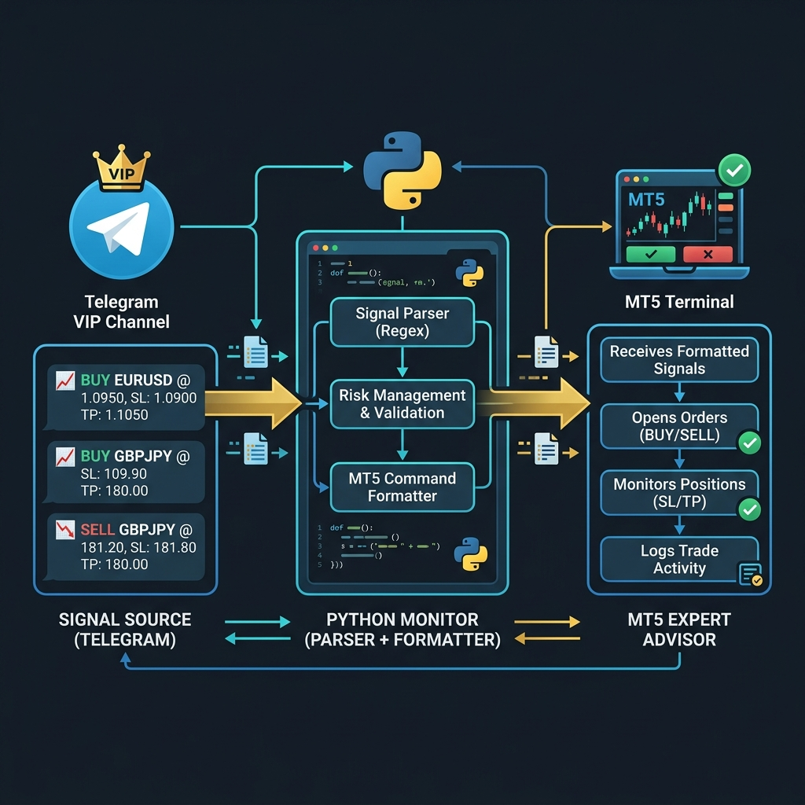
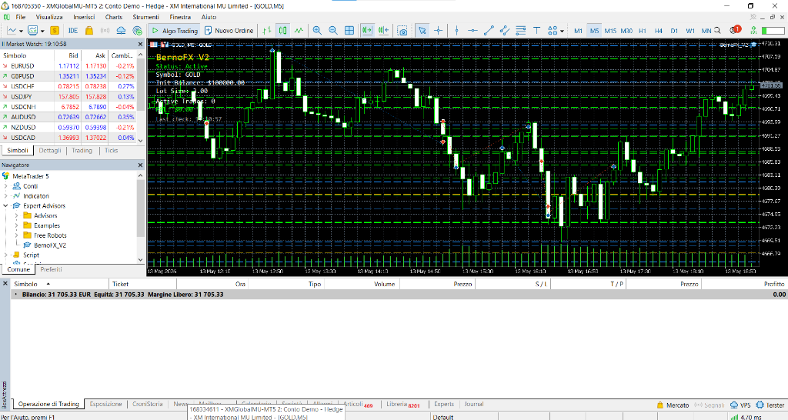
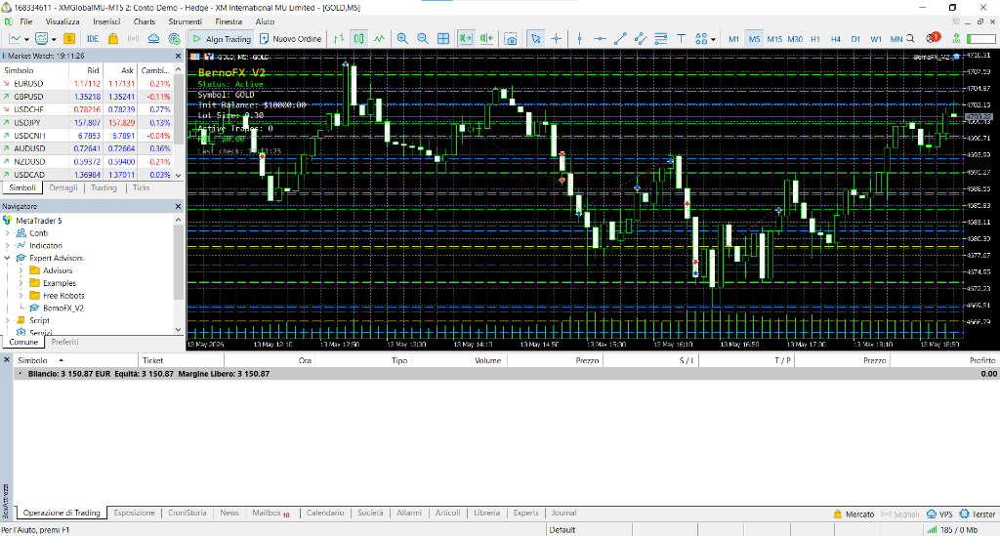
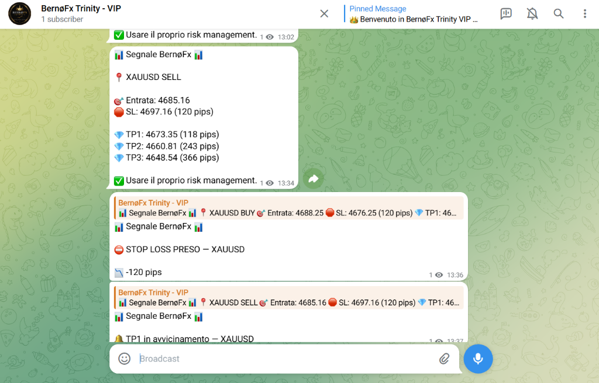

<p align="center">
  
</p>

<h1 align="center">🤖 BernoFX V2 — Telegram-to-MT5 Trading Bot</h1>

<p align="center">
  <strong>Automated Signal Copier · Triple Take-Profit · Partial Close · Italian VIP Formatter</strong>
</p>

<p align="center">
  
  
  
  
  
</p>

<p align="center">
  <a href="docs/BernoFX_V2_Report.pdf"><strong>📄 Tải Báo Cáo PDF</strong></a>
</p>

---

## 📖 Overview

**BernoFX V2** is a production-grade automated trading system that bridges **Telegram signal channels** with **MetaTrader 5** for hands-free trade execution.

### 🎯 What It Does

1. 📡 **Monitors** a premium Telegram VIP signal channel 24/7
2. 🧠 **Classifies & Parses** 7 types of market messages (signals, TP hits, SL hits, approaching, trade closed, updates)
3. 🔍 **Filters** only 3-TP signals for high-quality trade setups
4. ⚡ **Executes** trades on MT5 with auto-calculated lot sizes
5. 📊 **Manages** partial closes at each TP level with smart SL management
6. 🇮🇹 **Formats** and forwards all signals in professional Italian to a client VIP group

---

## 🏗️ System Architecture

```
┌─────────────────────┐     ┌──────────────────────┐     ┌─────────────────────┐
│  Signal Source      │     │   Python Monitor     │     │   MT5 Terminal      │
│  (Telegram VIP)     │────▶│                      │────▶│                     │
│                     │     │  ● Message Parser    │     │  ● Expert Advisor   │
│  SIGNAL ALERT       │     │  ● Signal Filter     │     │  ● Auto Lot Size   │
│  TP1/TP2/TP3 HIT   │     │  ● Italian Formatter │     │  ● Partial Close    │
│  SL HIT             │     │  ● State Manager     │     │  ● SL Management   │
└─────────────────────┘     │  ● Chain Tracker     │     └─────────────────────┘
                            │                      │
                            │         │            │
                            └─────────┼────────────┘
                                      │
                                      ▼
                            ┌──────────────────────┐
                            │  Client VIP Channel  │
                            │  (Italian Formatted) │
                            │                      │
                            │  📊 Segnale BernøFx   │
                            │  📍 XAUUSD BUY        │
                            │  💎 TP1/TP2/TP3        │
                            └──────────────────────┘
```

---

## 📸 Live Screenshots

### MT5 — Account $100K (XM Global)
<p align="center">
  
</p>

> **Balance: €31,705** · EA: BernoFX V2 · Status: Active · Lot: 3.00 · Triple TP lines on chart

### MT5 — Account $10K (XM Global)
<p align="center">
  
</p>

> **Balance: €3,150** · EA: BernoFX V2 · Status: Active · Lot: 0.30

### BernøFx Trinity — VIP Channel (Live)
<p align="center">
  
</p>

> Live signal forwarding: Signal → TP Approaching → SL Hit — all reply-linked to original signal.

---

## ✨ Key Features

### 🔄 Telegram Monitor (Python)
- **Real-time** message monitoring via Telethon API
- **7-type classifier**: signal, tp1/2/3_hit, sl_hit, tp_approaching, trade_closed
- **Dual-layer deduplication**: Message ID + MD5 hash with 60s window
- **Chain tracker**: Links follow-up messages (TP/SL hits) back to original signal
- **Persistent state**: JSON-based trade state survives bot restarts
- **Reply forwarding**: Follow-up messages reply to original signal in VIP channel
- **Auto-restart**: Batch launcher with 5-second restart loop

### ⚡ MT5 Expert Advisor (MQL5)
- **Auto lot sizing**: `Balance ÷ 1000 × 0.03` (configurable)
- **Triple Take-Profit**: Partial close 1/3 at each TP level
- **Smart SL management**:
  - Before TP1: SL at original position
  - After TP1: SL moves to Entry (break-even)
  - After TP2/TP3: SL stays at Entry
- **TP visualization**: Draws TP1 (green), TP2 (blue), TP3 (gold) lines on chart
- **Price deviation filter**: Skips stale signals
- **Cooldown protection**: Prevents duplicate orders
- **On-chart dashboard**: Real-time status display

### 🇮🇹 Italian Message Format
- Professional emoji-rich formatting
- Automatic pip calculation for SL/TP distances
- Reply-linked TP/SL updates for context

---

## 🎯 Trading Logic — Example

```
Signal: SELL XAUUSD @ 4742.03
SL: 4756.91 | TP1: 4727.85 | TP2: 4712.11 | TP3: 4697.58
Account: $10,000 → Lot: 0.30
```

| Event | Action | Volume | SL |
|-------|--------|--------|----|
| **Open** | SELL 0.30 lot | 0.30 | 4756.91 |
| **TP1 Hit** | Close 0.10 lot | 0.20 | → 4742.03 (break-even) |
| **TP2 Hit** | Close 0.10 lot | 0.10 | 4742.03 (stay) |
| **TP3 Hit** | Close 0.10 lot | 0.00 ✅ | Trade complete |

---

## 📋 Signal Format Examples

### 📥 New Signal
```
📊 Segnale BernøFx 📊

📍 XAUUSD BUY

🎯 Entrata: 4581
🛑 SL: 4571 (100 pips)

💎 TP1: 4586 (100 pips)
💎 TP2: 4591 (200 pips)
💎 TP3: 4598 (300 pips)

✅ Usare il proprio risk management.
```

### ✅ TP Hit (Reply to Signal)
```
📊 Segnale BernøFx 📊

💎 TP1 PRESO — XAUUSD

📈 Profitto +100 pips
🔒 SL spostato in Break Even
```

### ❌ SL Hit (Reply to Signal)
```
📊 Segnale BernøFx 📊

⛔️ STOP LOSS PRESO — XAUUSD

📉 -100 pips
```

---

## 🛠️ Tech Stack

| Component | Technology |
|-----------|-----------|
| **Signal Monitor** | Python 3.11 + Telethon |
| **Message Parser** | Regex-based classifier |
| **Trade Execution** | MQL5 Expert Advisor |
| **State Persistence** | JSON files |
| **Deployment** | Windows VPS + Scheduled Task |
| **Broker** | XM Global (MT5) |

---

## 📂 Project Structure

```
BernoFX-V2/
├── MT5_EA/
│   └── BernoFX_V2.mq5           # Expert Advisor (order engine)
├── TG_parser/
│   ├── config.py                 # API credentials & channel config
│   ├── tg_monitor.py             # Main monitor loop + event handlers
│   ├── message_parser.py         # Signal classification & data extraction
│   ├── message_formatter.py      # Italian formatting with emoji
│   ├── state_manager.py          # Chain tracker, dedup, signal writer
│   ├── requirements.txt          # Python dependencies (telethon)
│   ├── start_monitor.bat         # Auto-restart launcher
│   └── install_service.bat       # Windows Service installer
├── docs/
│   ├── architecture.png
│   ├── mt5_dashboard.png
│   └── telegram_signals.png
└── README.md
```

---

## ⚠️ Disclaimer

> This is a **showcase repository**. Source code is not included.
> This system is deployed in production for a private client.
> For inquiries, contact **VQuant Development**.

---

## 📄 License

All rights reserved. This software is proprietary and confidential.

---

<p align="center">
  <strong>Built with ❤️ by VQuant</strong>
  <br/>
  <em>Automated Trading Solutions</em>
</p>
